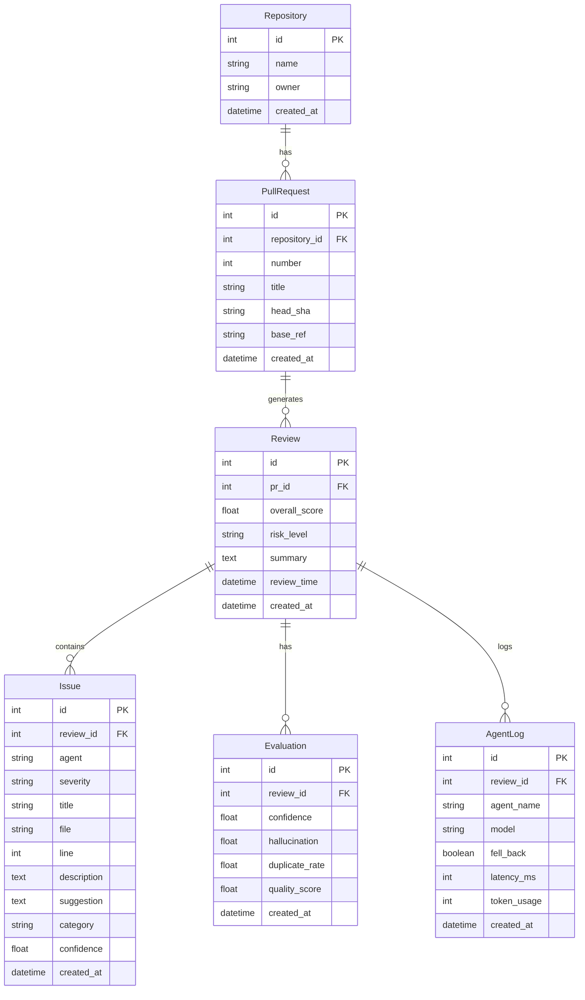

# CodeGuardian AI

> **Multi-Agent AI Code Review Platform with Automated GitHub PR Gatekeeping.**

CodeGuardian AI listens for GitHub pull-request webhooks, runs a multi-agent
LLM review pipeline (powered by Groq + Gemini with automatic fallback),
cross-references findings with static-analysis scanners (Semgrep, Bandit,
Ruff), and posts a structured review comment + Check Run back to GitHub —
all in seconds.

---

## Table of Contents

1. [Architecture Overview](#architecture-overview)
2. [Key Features](#key-features)
3. [How It Works — Pipeline Walkthrough](#how-it-works--pipeline-walkthrough)
4. [Agent System](#agent-system)
5. [Static Analysis Scanners](#static-analysis-scanners)
6. [Evaluation Layer](#evaluation-layer)
7. [Database Schema](#database-schema)
8. [Observability (LangSmith)](#observability-langsmith)
9. [Project Structure](#project-structure)
10. [Quick Start](#quick-start)
11. [Configuration](#configuration)
12. [API Reference](#api-reference)
13. [Docker Deployment](#docker-deployment)
14. [GitHub Webhook & Branch Protection Setup](#github-webhook--branch-protection-setup)
15. [Testing](#testing)
16. [Tech Stack](#tech-stack)

---

## Architecture Overview

```
┌──────────────┐     webhook      ┌──────────────────────────────────────────┐
│   GitHub     │ ───────────────► │           FastAPI Application            │
│  Pull Request│                  │  ┌────────────────────────────────────┐  │
│    Event     │ ◄─────────────── │  │  POST /github/webhook              │  │
└──────────────┘  comment +       │  │  (HMAC-SHA256 signature verify)    │  │
                  check run       │  └───────────────┬────────────────────┘  │
                                  │                  │ BackgroundTask         │
                                  │                  ▼                       │
                                  │  ┌────────────────────────────────────┐  │
                                  │  │      run_review_pipeline()         │  │
                                  │  │                                    │  │
                                  │  │  1. Start Check Run (in_progress)   │  │
                                  │  │  2. Fetch PR diff + changed files   │  │
                                  │  │  3. Run static analysis scanners    │  │
                                  │  │  4. LangGraph multi-agent workflow  │  │
                                  │  │     ├─ Security Agent               │  │
                                  │  │     ├─ Bug Agent                    │  │
                                  │  │     ├─ Performance Agent             │  │
                                  │  │     ├─ Quality Agent                │  │
                                  │  │     ├─ Architecture Agent            │  │
                                  │  │     ├─ Consensus Agent (merge)      │  │
                                  │  │     ├─ Risk Score Agent             │  │
                                  │  │     └─ Report Agent (markdown)      │  │
                                  │  │  5. Persist review + issues + eval  │  │
                                  │  │  6. Post / update PR comment         │  │
                                  │  │  7. Complete Check Run (pass/fail)  │  │
                                  │  └────────────────────────────────────┘  │
                                  │                                        │
                                  │  ┌──────────┐  ┌──────────────────┐     │
                                  │  │ SQLite   │  │  LangSmith       │     │
                                  │  │ Database │  │  Tracing (opt.)  │     │
                                  │  └──────────┘  └──────────────────┘     │
                                  └──────────────────────────────────────────┘
```

### LangGraph Workflow (Fan-Out / Fan-In)

The review pipeline is orchestrated by a LangGraph `StateGraph` using a
fan-out / fan-in pattern. Five specialist agents run in **parallel**,
their findings are merged by the consensus agent, and then three agents run
**sequentially** to produce the final verdict and report.

```
                         ┌──────────────────┐
                         │   load_pr_node    │  ← loads PR metadata + diff
                         └────────┬──────────┘
                                  │
                         ┌────────▼──────────┐
                         │ static_analysis   │  ← Semgrep + Bandit + Ruff
                         └────────┬──────────┘
                                  │
                         ┌────────▼──────────┐
                         │   router_node     │  ← decides which agents to run
                         └────────┬──────────┘
                                  │
              ┌───────────────────┼───────────────────┐
              │                   │                   │
     ┌────────▼──────┐  ┌────────▼──────┐  ┌────────▼──────┐
     │ security_node │  │   bug_node    │  │ perf_node     │
     └────────┬──────┘  └────────┬──────┘  └────────┬──────┘
              │                   │                   │
     ┌────────▼──────┐  ┌────────▼──────┐            │
     │ quality_node  │  │ arch_node     │            │
     └────────┬──────┘  └────────┬──────┘            │
              │                   │                   │
              └───────────────────┼───────────────────┘
                                  │
                         ┌────────▼──────────┐
                         │  consensus_node   │  ← merge + deduplicate
                         └────────┬──────────┘
                                  │
                         ┌────────▼──────────┐
                         │    risk_node      │  ← compute risk score
                         └────────┬──────────┘
                                  │
                         ┌────────▼──────────┐
                         │   report_node     │  ← generate markdown report
                         └───────────────────┘
```

The graph state is defined by [`CodeGuardianState`](codeguardian-ai/graph/state.py:19),
a `TypedDict` with `Annotated[list[dict], operator.add]` reducers that
automatically concatenate findings from parallel agents.

### LLM Routing

```
invoke_llm(system_prompt, user_prompt)
    │
    ├─ Try Groq (primary) ──► success? ──► return LLMResponse(fell_back=False)
    │
    └─ On failure ──► Try Gemini (fallback) ──► success?
                         ├─ Yes ──► return LLMResponse(fell_back=True)
                         └─ No   ──► raise RuntimeError
```

- If `GROQ_API_KEY` is empty, Groq is skipped entirely and Gemini is used directly.
- If both keys are empty, a `RuntimeError` is raised immediately.
- The `fell_back` flag is propagated through the state for observability.
- LLM temperature is `0.0` by default for deterministic, reproducible reviews.

### Risk Scoring

| Overall Score | Verdict           | Check Run Conclusion |
|---------------|-------------------|----------------------|
| ≥ 0.8         | `APPROVE`         | ✅ success           |
| ≥ 0.4         | `REQUEST_CHANGES` | ⚠️ failure           |
| < 0.4         | `BLOCK_MERGE`     | ❌ failure           |

**Formula:** `overall = 0.5 × security + 0.3 × maintainability + 0.2 × performance`

Where each sub-score is derived from the worst-severity finding produced by
the corresponding agent(s):

| Sub-score        | Source Agents              | Score per severity                          |
|------------------|----------------------------|---------------------------------------------|
| `security`       | Security Agent             | CRITICAL=0.1, HIGH=0.3, MEDIUM=0.6, LOW=0.8, INFO=0.95, none=1.0 |
| `maintainability`| Quality + Architecture     | (worst of the two)                          |
| `performance`    | Performance Agent          | (same scale)                                 |

If no findings are produced by any agent, all sub-sores default to `1.0`,
yielding an overall score of `1.0` → `APPROVE`.

---

## Key Features

- **8 Specialized Agents** orchestrated via LangGraph (fan-out / fan-in pattern)
- **Dual LLM Provider** with automatic Groq → Gemini fallback
- **3 Static Analysis Scanners** (Semgrep, Bandit, Ruff) cross-referenced with LLM findings
- **HMAC-SHA256 Webhook Verification** for secure GitHub integration
- **GitHub Check Runs** with pass/fail conclusions for branch-protection gatekeeping
- **Idempotent PR Comments** — updates existing comment on re-push instead of spamming
- **SQLite Persistence** — reviews, issues, evaluations, and agent logs stored for audit
- **LangSmith Tracing** — full observability of LLM calls, token usage, and latency
- **Evaluation Layer** — hallucination rate, duplicate detection, severity consistency, completeness
- **Automatic Diff Truncation** — protects LLM context windows on large PRs
- **Smart Agent Routing** — only activates relevant agents based on diff content
- **Graceful Degradation** — if LLM is unavailable, fallback reports are generated
- **Comprehensive Test Suite** — 321 tests, fully self-contained, no network required

---

## How It Works — Pipeline Walkthrough

When a GitHub PR webhook arrives at `POST /github/webhook`, the following
pipeline executes as a FastAPI `BackgroundTask`:

### Step 1 — Webhook Reception & Verification

1. The raw request body and `X-Hub-Signature-256` header are extracted.
2. [`verify_signature()`](codeguardian-ai/github/webhook.py:79) computes
   `HMAC-SHA256(secret, body)` and compares it to the header using
   `hmac.compare_digest()` (constant-time comparison to prevent timing
   attacks).
3. If the secret is empty (development mode), verification is bypassed.
4. The payload is parsed as JSON via [`safe_parse_json()`](codeguardian-ai/github/webhook.py:187).
5. [`parse_pull_request_event()`](codeguardian-ai/github/webhook.py:133)
   extracts the repository full name, PR number, head SHA, base ref, action,
   and title.
6. [`is_pull_request_action_relevant()`](codeguardian-ai/github/webhook.py:124)
   filters to only `opened`, `synchronize`, and `reopened` actions.

### Step 2 — Check Run Start

[`start_check()`](codeguardian-ai/github/checks.py:51) creates a GitHub
Check Run with status `in_progress` so the PR immediately shows a pending
check. This provides instant feedback to the developer that the review is
running.

### Step 3 — Diff & File Retrieval

[`fetch_pr_diff()`](codeguardian-ai/github/github_api.py:94) retrieves the
unified diff via the GitHub API. [`fetch_changed_files()`](codeguardian-ai/github/github_api.py:140)
retrieves the list of changed file paths. The diff is parsed by
[`parse_diff()`](codeguardian-ai/github/diff.py:129) into `FileDiff` objects,
each containing `DiffHunk` entries with added line numbers.

If the diff exceeds `MAX_DIFF_CHARS` (default: 40,000), it is truncated to
protect the LLM context window. A truncation notice is appended.

### Step 4 — Static Analysis

[`run_static_analysis()`](codeguardian-ai/scanners/pipeline.py:28) executes
all enabled scanners in sequence:

1. **Semgrep** — runs `semgrep --json` on the changed files
2. **Bandit** — runs `bandit -f json` on Python files only
3. **Ruff** — runs `ruff check --output-format json` on Python files only

Each scanner's JSON output is parsed into [`ScannerFinding`](codeguardian-ai/scanners/parser.py:37)
objects and merged into a single [`ScannerResult`](codeguardian-ai/scanners/parser.py:73)
via [`merge_results()`](codeguardian-ai/scanners/parser.py:114). The merged
result is formatted as a markdown context block by
[`format_as_context()`](codeguardian-ai/scanners/parser.py:144) and passed
to each agent as additional context.

Scanners that are not installed or fail are silently skipped — the pipeline
degrades gracefully.

### Step 5 — LangGraph Multi-Agent Workflow

[`build_graph()`](codeguardian-ai/graph/workflow.py:63) compiles the
LangGraph `StateGraph` and the workflow is invoked with the initial state:


  
The five specialist agents run in parallel (fan-out), each receiving the
full state. Their findings are accumulated via the `operator.add` reducer.
Then consensus → risk → report run sequentially (fan-in).

### Step 6 — Persistence

[`_persist_review()`](codeguardian-ai/api/routes.py:310) stores the review
in SQLite:

1. [`get_or_create_repository()`](codeguardian-ai/database/crud.py:57) —
   creates or fetches the repository record.
2. [`create_pull_request()`](codeguardian-ai/database/crud.py:75) — creates
   or fetches the PR record.
3. [`create_review()`](codeguardian-ai/database/crud.py:116) — stores the
   review with overall score, verdict, summary, and review time.
4. [`bulk_create_issues()`](codeguardian-ai/database/crud.py:190) — stores
   all findings as issue records.
5. [`evaluate_and_store()`](codeguardian-ai/evaluation/evaluator.py:178) —
   runs evaluation metrics and stores the evaluation record.
6. [`bulk_create_agent_logs()`](codeguardian-ai/database/crud.py:276) —
   stores per-agent execution logs (optional).

### Step 7 — Comment & Check Run Completion

[`update_or_post_comment()`](codeguardian-ai/github/comments.py:216) posts
the markdown review report as a PR comment. If a previous CodeGuardian AI
comment already exists (found via [`find_existing_comment()`](codeguardian-ai/github/comments.py:188)),
it updates that comment instead of creating a new one — preventing comment
spam on force-pushes.

[`complete_check()`](codeguardian-ai/github/checks.py:86) or
[`fail_check()`](codeguardian-ai/github/checks.py:155) completes the Check
Run with a `success` or `failure` conclusion based on the risk verdict.

If any exception occurs during the pipeline,
[`_safe_fail_check()`](codeguardian-ai/api/routes.py:446) marks the Check
Run as failed with the error message.

---

## Agent System

### Specialist Agents (Parallel — Fan-Out)

Each specialist agent follows the same pattern via
[`run_specialist_agent()`](codeguardian-ai/agents/base.py:246):

1. Load its system prompt from [`prompts/`](codeguardian-ai/prompts/__init__.py:24)
   via [`load_prompt()`](codeguardian-ai/prompts/__init__.py:24) (cached with `lru_cache`).
2. Build a user prompt via [`build_user_prompt()`](codeguardian-ai/agents/base.py:213)
   containing the code diff, scanner context, and file tree.
3. Call [`invoke_llm()`](codeguardian-ai/llm/router.py:94) with the system + user prompts.
4. Parse the LLM response as a JSON array via
   [`parse_findings_json()`](codeguardian-ai/agents/base.py:84).
5. Normalize each finding via [`_normalize_finding()`](codeguardian-ai/agents/base.py:168).
6. Return `{"findings": [...]}` which the `operator.add` reducer concatenates.

| Agent | File | Prompt | Focus |
|-------|------|--------|-------|
| **Security** | [`security_agent.py`](codeguardian-ai/agents/security_agent.py:22) | [`security.txt`](codeguardian-ai/prompts/security.txt) | SQL injection, XSS, hardcoded secrets, auth bypass, path traversal |
| **Bug** | [`bug_agent.py`](codeguardian-ai/agents/bug_agent.py) | [`bug.txt`](codeguardian-ai/prompts/bug.txt) | Logic errors, null dereference, off-by-one, race conditions, resource leaks |
| **Performance** | [`performance_agent.py`](codeguardian-ai/agents/performance_agent.py) | [`performance.txt`](codeguardian-ai/prompts/performance.txt) | N+1 queries, unnecessary allocations, algorithmic complexity, I/O bottlenecks |
| **Quality** | [`quality_agent.py`](codeguardian-ai/agents/quality_agent.py) | [`quality.txt`](codeguardian-ai/prompts/quality.txt) | Naming, dead code, complexity, duplication, documentation gaps |
| **Architecture** | [`architecture_agent.py`](codeguardian-ai/agents/architecture_agent.py:24) | [`architecture.txt`](codeguardian-ai/prompts/architecture.txt) | Design patterns, coupling, separation of concerns, SOLID violations |

Each finding is a dict with the following structure:

```json
{
  "title": "SQL injection in query construction",
  "description": "User input is concatenated directly into the SQL query string.",
  "file": "app.py",
  "line": 42,
  "severity": "HIGH",
  "category": "injection",
  "confidence": 0.9,
  "suggestion": "Use parameterized queries with placeholders."
}
```

### Smart Agent Routing

Not all agents need to run on every PR. [`route_agents()`](codeguardian-ai/graph/router.py:88)
inspects the diff content and changed files to determine which agents to
activate:

- **Performance Agent** — activated when the diff contains performance-relevant
  patterns (loops, database queries, I/O operations) via
  [`should_run_performance()`](codeguardian-ai/graph/router.py:61).
- **Architecture Agent** — activated when new files are added or the diff
  touches structural files via [`should_run_architecture()`](codeguardian-ai/graph/router.py:70).
- **Security, Bug, Quality** — always run on every PR.

This reduces unnecessary LLM calls and speeds up the review.

### Consensus Agent (Sequential — Fan-In)

[`run_consensus_agent()`](codeguardian-ai/agents/consensus_agent.py:33)
merges and deduplicates findings from all specialist agents:

1. Collects findings from all agent keys in the state
   (`security_findings`, `bug_findings`, etc.).
2. If total findings are empty, exits early with an empty list.
3. Sends all findings to the LLM with the consensus prompt, asking it to
   merge duplicates, resolve conflicts, and prioritize by severity.
4. Parses the LLM response into a deduplicated, prioritized list.
5. Returns `{"consensus_findings": [...]}`.

### Risk Score Agent

[`run_risk_agent()`](codeguardian-ai/agents/risk_agent.py:167) computes
the overall risk score and merge recommendation:

1. [`_worst_score()`](codeguardian-ai/agents/risk_agent.py:55) finds the
   worst-severity finding from each agent group and maps it to a score
   (CRITICAL=0.1, HIGH=0.3, MEDIUM=0.6, LOW=0.8, INFO=0.95, none=1.0).
2. [`_compute_scores()`](codeguardian-ai/agents/risk_agent.py:90) combines
   the sub-scores: `security`, `maintainability` (quality + architecture),
   and `performance`.
3. Overall score: `0.5 × security + 0.3 × maintainability + 0.2 × performance`.
4. [`risk_verdict()`](codeguardian-ai/config.py:121) maps the score to a
   verdict: `APPROVE` (≥0.8), `REQUEST_CHANGES` (≥0.4), `BLOCK_MERGE` (<0.4).
5. The LLM is invoked with pre-computed scores to generate a human-readable
   summary. If the LLM fails, [`_default_summary()`](codeguardian-ai/agents/risk_agent.py:123)
   generates a fallback summary.

### Report Agent

[`run_report_agent()`](codeguardian-ai/agents/report_agent.py:51) generates
the final markdown review report:

1. Builds a user prompt with consensus findings, risk scores, and verdict.
2. Invokes the LLM with the report prompt to generate a structured markdown
   report.
3. If the LLM fails, [`_fallback_report()`](codeguardian-ai/agents/report_agent.py:121)
   generates a basic markdown report from the findings data directly.

The report includes:
- A summary header with the verdict and overall score
- A findings table (severity, file, line, title)
- Detailed sections per finding with suggestions
- Emoji indicators for severity and recommendation levels

---

## Static Analysis Scanners

Three static-analysis scanners run in parallel with the LLM agents, providing
ground-truth findings that are cross-referenced with LLM output in the
evaluation layer.

### Semgrep

[`run_semgrep()`](codeguardian-ai/scanners/semgrep_runner.py) executes
`semgrep --json --config auto <files>` as a subprocess. The JSON output is
parsed by `_parse_semgrep_json()` which extracts:

- `check_id` → mapped to a category
- `path` → file path
- `start.line` → line number
- `extra.message` → description
- `extra.severity` → mapped to CodeGuardian severity (ERROR→HIGH, WARNING→MEDIUM, INFO→INFO)

### Bandit

[`run_bandit()`](codeguardian-ai/scanners/bandit_runner.py) executes
`bandit -f json <python_files>` as a subprocess. Only `.py` files are
scanned. The JSON output is parsed by `_parse_bandit_json()` which extracts:

- `test_id` (e.g., `B101`) → mapped to a category
- `filename` → file path
- `line_number` → line number
- `issue_text` → description
- `issue_severity` → mapped to CodeGuardian severity (HIGH→HIGH, MEDIUM→MEDIUM, LOW→LOW)

### Ruff

[`run_ruff()`](codeguardian-ai/scanners/ruff_runner.py) executes
`ruff check --output-format json <python_files>` as a subprocess. Only `.py`
files are scanned. The JSON output is parsed by `_parse_ruff_json()` which
extracts:

- `code` (e.g., `E501`) → severity inferred by [`_infer_severity()`](codeguardian-ai/scanners/ruff_runner.py)
- `filename` → file path
- `location.row` → line number
- `message` → description

Ruff severity inference:
- `E` codes (errors) → `HIGH`
- `F` codes (pyflakes) → `MEDIUM`
- `W` codes (warnings) → `LOW`
- All others → `INFO`

### Result Merging

[`merge_results()`](codeguardian-ai/scanners/parser.py:114) combines all
scanner results into a single [`ScannerResult`](codeguardian-ai/scanners/parser.py:73)
with:
- All findings concatenated
- `raw_outputs` dict preserving each scanner's raw JSON
- Helper properties: `findings_by_scanner()`, `findings_by_severity()`, `has_critical`

The merged result is formatted as a markdown context block by
[`format_as_context()`](codeguardian-ai/scanners/parser.py:144) and passed
to each LLM agent as additional context.

---

## Evaluation Layer

The evaluation layer measures the quality of LLM-generated reviews against
the scanner ground truth. Six metrics are computed:

### Metrics

| Metric | Function | Description |
|--------|----------|-------------|
| **Hallucination Rate** | [`hallucination_rate()`](codeguardian-ai/evaluation/metrics.py:106) | Fraction of LLM findings that reference files/lines not in the actual diff. A finding is a hallucination if its `file` is not in the diff, or its `line` is not in the added lines of that file. |
| **Issue Relevance** | [`issue_relevance()`](codeguardian-ai/evaluation/metrics.py:164) | Keyword overlap between LLM findings and scanner findings. Uses Jaccard similarity on tokenized keywords (minus stop words). |
| **Duplicate Rate** | [`duplicate_rate()`](codeguardian-ai/evaluation/metrics.py:224) | Fraction of findings that are near-duplicates (same title + file, or Jaccard similarity > 0.8 on title tokens). |
| **Severity Consistency** | [`severity_consistency()`](codeguardian-ai/evaluation/metrics.py:263) | Checks if LLM-assigned severities match scanner-assigned severities for findings with matching titles. Within 1 rank = consistent. |
| **Completeness** | [`completeness()`](codeguardian-ai/evaluation/metrics.py:308) | Fraction of issue categories (from scanner findings) that are covered by at least one LLM finding. Categories: injection, secret, xss, auth, crypto, config, deserialization, path_traversal, logic, performance, quality, architecture. |
| **Markdown Formatting** | [`markdown_formatting()`](codeguardian-ai/evaluation/metrics.py:360) | Checks if the report has: (1) at least one header, (2) balanced code blocks, (3) at least one list item. Score = checks_passed / 3. |
| **Overall Confidence** | [`overall_confidence()`](codeguardian-ai/evaluation/metrics.py:420) | Weighted average of all metrics. Hallucination rate has the highest weight (inverted: lower hallucination = higher confidence). |

### Evaluator

[`evaluate_review()`](codeguardian-ai/evaluation/evaluator.py:115) runs
all metrics and returns a dict with scores, details, and a `hallucination_flag`
(boolean, true if hallucination rate > 0.5).

[`evaluate_from_state()`](codeguardian-ai/evaluation/evaluator.py:143)
extracts findings from the LangGraph state and runs evaluation.

[`evaluate_and_store()`](codeguardian-ai/evaluation/evaluator.py:178)
runs evaluation and persists the results to the `evaluations` table.

### Curated Datasets

[`datasets.py`](codeguardian-ai/evaluation/datasets.py) contains three
curated evaluation cases:

| Dataset | Description | Expected Findings |
|---------|-------------|-------------------|
| `sql_injection` | A diff that introduces a SQL injection vulnerability | Scanner detects injection; LLM should flag it |
| `hardcoded_secret` | A diff that adds a hardcoded API key | Scanner detects secret; LLM should flag it |
| `clean_code` | A diff with clean, well-structured code | No findings expected; high confidence |

Each dataset includes:
- `code_diff` — the unified diff
- `scanner_findings` — expected scanner output
- `expected_categories` — issue categories that should be detected
- `sample_report` — a reference markdown report for formatting validation

---

## Database Schema

Five SQLAlchemy ORM models with cascade deletes:

# My Project

This is a project about something awesome.

## Database Schema

Here is the Entity-Relationship diagram for the database:


**Cascade rules:** Deleting a Repository cascades to all PullRequests →
Reviews → Issues, Evaluations, and AgentLogs.

---

## Observability (LangSmith)

[`langsmith.py`](codeguardian-ai/observability/langsmith.py) provides
optional LangSmith tracing integration:

### Configuration

[`configure_tracing()`](codeguardian-ai/observability/langsmith.py:99) sets
LangSmith environment variables from application settings. Tracing is
enabled when `LANGCHAIN_TRACING_V2=true` and `LANGCHAIN_API_KEY` is set.

### Trace Metadata

[`ReviewTraceMeta`](codeguardian-ai/observability/langsmith.py:56) is a
dataclass that attaches review-specific metadata to the LangSmith trace:

- `review_id` — database review ID
- `pr_number` — GitHub PR number
- `repo_full_name` — repository full name
- `commit_sha` — commit being reviewed
- `overall_score` — final risk score
- `risk_verdict` — APPROVE / REQUEST_CHANGES / BLOCK_MERGE
- `agent_count` — number of agents that ran
- `finding_count` — total findings
- `fell_back` — whether the LLM fell back from Groq to Gemini

### Metric Extraction

[`extract_trace_metadata()`](codeguardian-ai/observability/langsmith.py:219)
extracts metrics from a completed LangSmith run:

- **Token usage** — prompt tokens, completion tokens, total tokens
- **Latency** — total execution time in seconds
- **Error** — error message if the run failed

[`record_review_metrics()`](codeguardian-ai/observability/langsmith.py:335)
builds a metrics dict for a completed review and attaches it to the trace.

---

## Project Structure

```
codeguardian-ai/
├── main.py                    # FastAPI app entry point (lifespan, /health, /ready)
├── config.py                  # Pydantic Settings (env-driven configuration)
├── requirements.txt           # Python dependencies
├── Dockerfile                 # Container image definition
├── docker-compose.yml         # One-command deployment
├── .dockerignore              # Excludes secrets/caches from image
├── .env.example               # Environment variable template
│
├── api/
│   ├── __init__.py            # Exports the APIRouter
│   └── routes.py              # Webhook endpoint + review retrieval endpoints
│
├── agents/
│   ├── base.py                # Shared agent utilities (JSON parsing, prompt building)
│   ├── security_agent.py      # Vulnerability detection specialist
│   ├── bug_agent.py           # Logic bug detection specialist
│   ├── performance_agent.py   # Performance issue specialist
│   ├── quality_agent.py       # Code quality / style specialist
│   ├── architecture_agent.py  # Design / structural issue specialist
│   ├── consensus_agent.py     # Merges & deduplicates all specialist findings
│   ├── risk_agent.py          # Computes risk scores + merge recommendation
│   └── report_agent.py        # Generates the final markdown review report
│
├── graph/
│   ├── state.py               # CodeGuardianState TypedDict (LangGraph state)
│   ├── router.py              # Routing logic (which agents to activate)
│   ├── nodes.py               # LangGraph node functions (binds agents to state)
│   └── workflow.py            # Builds & compiles the review_graph
│
├── llm/
│   ├── router.py              # invoke_llm() with Groq → Gemini fallback
│   ├── groq_client.py         # Groq API wrapper
│   └── gemini_client.py       # Gemini API wrapper
│
├── scanners/
│   ├── parser.py              # ScannerFinding / ScannerResult dataclasses + merge
│   ├── pipeline.py            # Orchestrates Semgrep + Bandit + Ruff
│   ├── semgrep_runner.py     # Semgrep subprocess runner + JSON parser
│   ├── bandit_runner.py      # Bandit subprocess runner + JSON parser
│   └── ruff_runner.py        # Ruff subprocess runner + JSON parser
│
├── github/
│   ├── webhook.py             # Signature verification + PR event parsing
│   ├── github_api.py          # PyGithub wrapper (fetch diff, files, post comments)
│   ├── comments.py            # Markdown comment formatting + idempotent posting
│   ├── checks.py              # Check Run lifecycle (start, complete, fail)
│   └── diff.py                # Unified-diff parser (FileDiff, DiffHunk, added lines)
│
├── database/
│   ├── database.py            # Engine, SessionLocal, init_db(), get_db() dependency
│   ├── models.py              # SQLAlchemy ORM models (5 tables)
│   └── crud.py                # CRUD operations for all models
│
├── evaluation/
│   ├── metrics.py             # 6 quality metrics (hallucination, relevance, etc.)
│   ├── evaluator.py           # evaluate_review() + evaluate_and_store()
│   └── datasets.py            # Curated evaluation datasets (SQL injection, clean code, etc.)
│
├── observability/
│   ├── __init__.py            # Exports tracing helpers
│   └── langsmith.py           # LangSmith tracing config + metadata + metric extraction
│
├── prompts/
│   ├── __init__.py            # load_prompt() with lru_cache
│   ├── security.txt           # Security agent system prompt
│   ├── bug.txt                # Bug agent system prompt
│   ├── performance.txt        # Performance agent system prompt
│   ├── quality.txt            # Quality agent system prompt
│   ├── architecture.txt       # Architecture agent system prompt
│   ├── consensus.txt          # Consensus agent system prompt
│   ├── risk.txt               # Risk agent system prompt
│   └── report.txt             # Report agent system prompt
│
├── reports/                   # Generated review artifacts (runtime, volume-mounted)
│   └── .gitkeep
│
└── tests/
    ├── test_api.py            # End-to-end API tests (TestClient, webhook, reviews)
    ├── test_webhook.py        # Webhook verification, parsing, diff parser tests
    ├── test_database.py       # ORM models + CRUD operations tests
    ├── test_scanners.py       # Scanner parsers + pipeline tests
    ├── test_agents.py         # Agent finding parsing + normalization tests
    ├── test_graph.py          # LangGraph workflow + routing tests
    ├── test_evaluation.py     # Evaluation metrics + evaluator + datasets tests
    └── test_llm_router.py     # LLM router fallback logic tests
```

---

## Quick Start

### Prerequisites

- Python 3.11+
- A GitHub Personal Access Token with `repo:status` and `checks:write` scopes
- A Groq API key (primary LLM) and/or a Gemini API key (fallback LLM)
- Optional: LangSmith API key for tracing
- Optional: Semgrep, Bandit, and Ruff installed for static analysis (scanners
  that are not installed are silently skipped)

### Local Development

```bash
# 1. Clone and enter the directory
cd codeguardian-ai

# 2. Create a virtual environment
python -m venv .venv
source .venv/bin/activate        # Linux/macOS
# .venv\Scripts\activate         # Windows

# 3. Install dependencies
pip install -r requirements.txt
pip install -e .                 # Register the package (for pytest pythonpath)

# 4. Configure environment
cp .env.example .env
# Edit .env and fill in your API keys

# 5. Run the server
python main.py
# or: uvicorn main:app --reload --host 0.0.0.0 --port 8000
```

The API will be available at `http://localhost:8000`.

- **Swagger UI**: `http://localhost:8000/docs`
- **ReDoc**: `http://localhost:8000/redoc`
- **Health check**: `http://localhost:8000/health`

### Installing Scanners (Optional but Recommended)

```bash
pip install semgrep bandit ruff
```

Or via the system package manager:

```bash
# macOS
brew install semgrep bandit ruff

# Ubuntu/Debian
pip install semgrep bandit ruff
```

---

## Configuration

All configuration is driven by environment variables (see [`.env.example`](.env.example)).

### LLM Configuration

| Variable                   | Default                        | Description                              |
|----------------------------|--------------------------------|------------------------------------------|
| `GROQ_API_KEY`             | *(empty)*                      | Groq API key (primary LLM)              |
| `GEMINI_API_KEY`           | *(empty)*                      | Gemini API key (fallback LLM)           |
| `GROQ_MODEL`               | `llama-3.3-70b-versatile`      | Groq model name                          |
| `GEMINI_MODEL`             | `gemini-2.0-flash`             | Gemini model name                        |
| `LLM_TEMPERATURE`          | `0.0`                          | LLM sampling temperature                 |
| `LLM_TIMEOUT_SECONDS`      | `30`                           | LLM request timeout (seconds)            |

### GitHub Configuration

| Variable                   | Default                        | Description                              |
|----------------------------|--------------------------------|------------------------------------------|
| `GITHUB_TOKEN`             | *(empty)*                      | GitHub PAT (`repo:status`, `checks:write`) |
| `GITHUB_WEBHOOK_SECRET`    | *(empty)*                      | HMAC-SHA256 webhook secret              |

### Observability Configuration

| Variable                   | Default                        | Description                              |
|----------------------------|--------------------------------|------------------------------------------|
| `LANGCHAIN_TRACING_V2`     | `true`                         | Enable LangSmith tracing                 |
| `LANGCHAIN_API_KEY`        | *(empty)*                      | LangSmith API key                        |
| `LANGCHAIN_PROJECT`         | `codeguardian-ai`              | LangSmith project name                   |
| `LANGCHAIN_ENDPOINT`        | `https://api.smith.langchain.com` | LangSmith API endpoint               |

### Database Configuration

| Variable                   | Default                        | Description                              |
|----------------------------|--------------------------------|------------------------------------------|
| `DATABASE_URL`              | `sqlite:///./review.db`        | SQLAlchemy database URL                  |

### Application Configuration

| Variable                   | Default                        | Description                              |
|----------------------------|--------------------------------|------------------------------------------|
| `MAX_DIFF_CHARS`            | `40000`                        | Max diff size sent to LLM (chars)        |
| `RISK_PASS_THRESHOLD`       | `0.8`                         | Score ≥ this → APPROVE                   |
| `RISK_WARN_THRESHOLD`       | `0.4`                         | Score ≥ this → REQUEST_CHANGES           |
| `APP_HOST`                  | `0.0.0.0`                     | Server bind address                       |
| `APP_PORT`                  | `8000`                        | Server port                               |
| `APP_LOG_LEVEL`             | `info`                        | Logging level                             |

### Scanner Configuration

| Variable                   | Default                        | Description                              |
|----------------------------|--------------------------------|------------------------------------------|
| `ENABLE_SEMGREP`            | `true`                        | Enable Semgrep scanner                    |
| `ENABLE_BANDIT`             | `true`                        | Enable Bandit scanner                     |
| `ENABLE_RUFF`               | `true`                        | Enable Ruff scanner                       |

---

## API Reference

### `POST /github/webhook`

Receive a GitHub webhook delivery.

**Headers:**
- `X-Hub-Signature-256`: HMAC-SHA256 signature (required if webhook secret is set)
- `Content-Type`: `application/json`

**Response (200):**
```json
{
  "status": "accepted",
  "pr_number": 42,
  "commit_sha": "abc123def456789",
  "message": "Review pipeline started"
}
```

| Status   | Condition                                    | HTTP Code |
|----------|----------------------------------------------|-----------|
| accepted | Valid PR webhook with relevant action        | 200       |
| ignored  | Not a PR event, or action not in trigger set  | 200       |
| —        | Invalid signature                            | 401       |
| —        | Malformed JSON                               | 400       |

**Triggered actions:** `opened`, `synchronize`, `reopened`

The review pipeline runs asynchronously as a `BackgroundTask`. The endpoint
returns immediately with a `202`-style acceptance response (HTTP 200 with
`status: "accepted"`), and the review comment + Check Run are posted when
the pipeline completes.

---

### `GET /reviews/{review_id}`

Retrieve a single review by ID, including issues and evaluation.

**Response (200):**
```json
{
  "id": 1,
  "pr_id": 1,
  "overall_score": 0.65,
  "risk_level": "REQUEST_CHANGES",
  "summary": "Found 2 issues that should be addressed.",
  "review_time": 3.5,
  "created_at": "2026-01-15T10:30:00",
  "issues": [
    {
      "id": 1,
      "agent": "security",
      "severity": "HIGH",
      "title": "SQL injection in query",
      "file": "app.py",
      "line": 42,
      "description": "User input is concatenated directly.",
      "suggestion": "Use parameterized queries."
    }
  ],
  "evaluation": {
    "id": 1,
    "confidence": 0.85,
    "hallucination": false,
    "duplicate_rate": 0.0,
    "quality_score": 0.9
  }
}
```

**Errors:** `404` if review not found.

---

### `GET /reviews`

List recent reviews with pagination.

**Query Parameters:**
- `limit` (int, default=20, min=1, max=100)
- `offset` (int, default=0, min=0)

**Response (200):**
```json
{
  "reviews": [ /* ReviewResponse[] */ ],
  "total": 42,
  "limit": 20,
  "offset": 0
}
```

**Errors:** `422` if `limit` < 1, `limit` > 100, or `offset` < 0.

---

### `GET /health`

Liveness probe — always returns 200.

```json
{"status": "ok", "service": "codeguardian-ai"}
```

### `GET /ready`

Readiness probe — checks LLM keys, GitHub token, and tracing status.

```json
{"status": "ok", "tracing": "enabled"}
```

| `status` | Condition |
|----------|-----------|
| `ok` | At least one LLM key is configured |
| `not_ready` | No LLM keys configured |

The `tracing` field reports `enabled` or `disabled` based on LangSmith configuration.

---

## Docker Deployment

### One-Command Deploy

```bash
cd codeguardian-ai
cp .env.example .env
# Edit .env with your real API keys

docker compose up --build -d
```

The service will be available at `http://localhost:8000`.

### Manual Docker Build

```bash
docker build -t codeguardian-ai ./codeguardian-ai
docker run --env-file .env -p 8000:8000 -d codeguardian-ai
```

### Dockerfile Details

The [`Dockerfile`](codeguardian-ai/Dockerfile) uses a multi-stage build:

1. **Base image**: `python:3.11-slim`
2. **System dependencies**: Installs `gcc` and `libffi-dev` for compiling
   Python C extensions (cryptography, etc.)
3. **Python dependencies**: Copies `requirements.txt` and runs `pip install`
4. **Application code**: Copies the entire `codeguardian-ai/` directory
5. **Health check**: `HEALTHCHECK --interval=30s --timeout=5s` hitting `GET /health`
6. **Entry point**: `uvicorn main:app --host 0.0.0.0 --port 8000`

### Volumes

| Volume         | Mount Path       | Purpose                              |
|----------------|------------------|--------------------------------------|
| `db_data`     | `/app/review.db` | Persists SQLite database             |
| `reports_data` | `/app/reports`   | Persists generated review artifacts  |

### Health Check

The Dockerfile includes a `HEALTHCHECK` that hits `GET /health` every 30 seconds.
Docker reports the container as `healthy` after 3 consecutive successes and
`unhealthy` after 3 consecutive failures.

---

## GitHub Webhook & Branch Protection Setup

### Step 1: Create a GitHub App or PAT

Create a Personal Access Token at
[https://github.com/settings/tokens](https://github.com/settings/tokens) with:
- `repo:status` — to post review comments
- `checks:write` — to create Check Runs

Set it as `GITHUB_TOKEN` in your `.env`.

### Step 2: Configure the Webhook

In your repository settings (**Settings → Webhooks → Add webhook**):

| Field              | Value                                      |
|--------------------|--------------------------------------------|
| **Payload URL**   | `https://your-domain.com/github/webhook`   |
| **Content type**  | `application/json`                         |
| **Secret**        | *(generate with `python -c "import secrets; print(secrets.token_hex(20))"`)* |
| **Events**        | Let me select individual events → **Pull requests** |

Set the same secret as `GITHUB_WEBHOOK_SECRET` in your `.env`.

### Step 3: Enable Branch Protection

In your repository settings (**Settings → Branches → Add rule**):

1. **Branch name pattern:** `main` (or your default branch)
2. **Require status checks to pass before merging** → ✅ Enable
3. **Require branches to be up to date before merging** → ✅ Enable
4. Search for the Check Run name (e.g., `CodeGuardian AI`) and select it
5. **Require pull request reviews before merging** → ✅ Enable (optional)

Now every PR to `main` will be automatically reviewed by CodeGuardian AI, and
the Check Run must pass before merging is allowed.

### How the Check Run Works

1. When a PR webhook is received, [`start_check()`](codeguardian-ai/github/checks.py:51)
   creates a Check Run with `status: "in_progress"`.
2. The review pipeline runs (agents, scanners, evaluation).
3. On success, [`complete_check()`](codeguardian-ai/github/checks.py:86) sets:
   - `status: "completed"`
   - `conclusion: "success"` if verdict is `APPROVE`
   - `conclusion: "failure"` if verdict is `REQUEST_CHANGES` or `BLOCK_MERGE`
4. On error, [`fail_check()`](codeguardian-ai/github/checks.py:155) sets:
   - `status: "completed"`
   - `conclusion: "failure"`
   - `output.title: "Review failed"`
   - `output.summary: <error message>`

---

## Testing

### Run the Full Test Suite

```bash
# From the project root (where pyproject.toml lives)
python -m pytest codeguardian-ai/tests/ -v
```

### Run a Specific Test File

```bash
python -m pytest codeguardian-ai/tests/test_api.py -v
python -m pytest codeguardian-ai/tests/test_webhook.py -v
python -m pytest codeguardian-ai/tests/test_graph.py -v
python -m pytest codeguardian-ai/tests/test_evaluation.py -v
```

### Run with Short Tracebacks

```bash
python -m pytest codeguardian-ai/tests/ -v --tb=short
```

### Test Files

| File                  | Tests | Description                                                    |
|-----------------------|-------|----------------------------------------------------------------|
| `test_api.py`         | 16    | End-to-end API tests (TestClient, webhook, reviews, health)   |
| `test_webhook.py`    | 144   | Signature verification, PR parsing, diff parser                |
| `test_database.py`   | 14    | ORM models, CRUD operations, cascade deletes                  |
| `test_scanners.py`   | 30    | Scanner parsers, merge logic, pipeline orchestration           |
| `test_agents.py`     | 42    | Agent finding parsing, normalization, prompt building         |
| `test_graph.py`      | 21    | LangGraph workflow, routing logic, node functions              |
| `test_evaluation.py` | 47    | Metrics, evaluator, curated datasets, integration             |
| `test_llm_router.py` | 7     | Groq → Gemini fallback logic                                  |
| **Total**            | **321** | **All passing**                                               |

All tests are fully self-contained — no network access or real API keys required.
LLM calls are mocked, scanner subprocesses are mocked, and GitHub API calls
are mocked. The test suite runs in under 3 seconds.

### Test Architecture

- **In-memory SQLite**: All database tests use `sqlite:///:memory:` with
  `StaticPool` + `check_same_thread=False` to share a single connection
  across threads (required for FastAPI `TestClient`).
- **Mocked LLM**: `unittest.mock.MagicMock` replaces
  [`invoke_llm()`](codeguardian-ai/llm/router.py:94) with canned responses.
- **Mocked subprocess**: `unittest.mock.patch("subprocess.run")` replaces
  scanner subprocess calls with fixture JSON.
- **Mocked GitHub API**: `unittest.mock.patch` replaces PyGithub client
  methods with mock objects.
- **Fixture isolation**: Each test gets a fresh database session via the
  `db` / `db_session` pytest fixtures.

---

## Tech Stack

| Category | Technology | Purpose |
|----------|-----------|---------|
| **Web Framework** | FastAPI | Async API server with automatic OpenAPI docs |
| **ASGI Server** | Uvicorn | High-performance ASGI server |
| **LLM Orchestration** | LangGraph | Multi-agent stateful workflow graph |
| **LLM Providers** | Groq (primary), Google Gemini (fallback) | Dual-provider with automatic failover |
| **Static Analysis** | Semgrep, Bandit, Ruff | Multi-language + Python-specific scanning |
| **GitHub Integration** | PyGithub | GitHub API client (diff, comments, check runs) |
| **Database** | SQLAlchemy + SQLite | ORM with 5 models, cascade deletes |
| **Configuration** | Pydantic Settings | Environment-driven, validated configuration |
| **Observability** | LangSmith | LLM call tracing, token usage, latency metrics |
| **Testing** | pytest + pytest-asyncio | 321 tests, fully mocked, < 3s runtime |
| **Containerization** | Docker + Docker Compose | Production deployment with health checks |
| **Python** | 3.11+ | Modern Python with type hints throughout |

---

## License

This project is proprietary and confidential.
