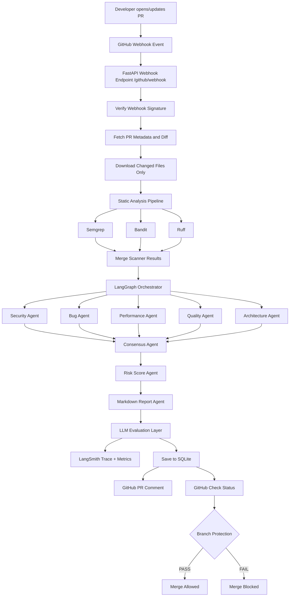
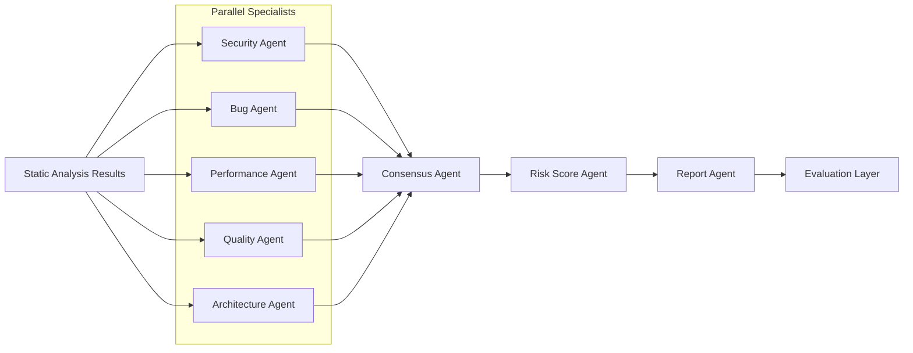
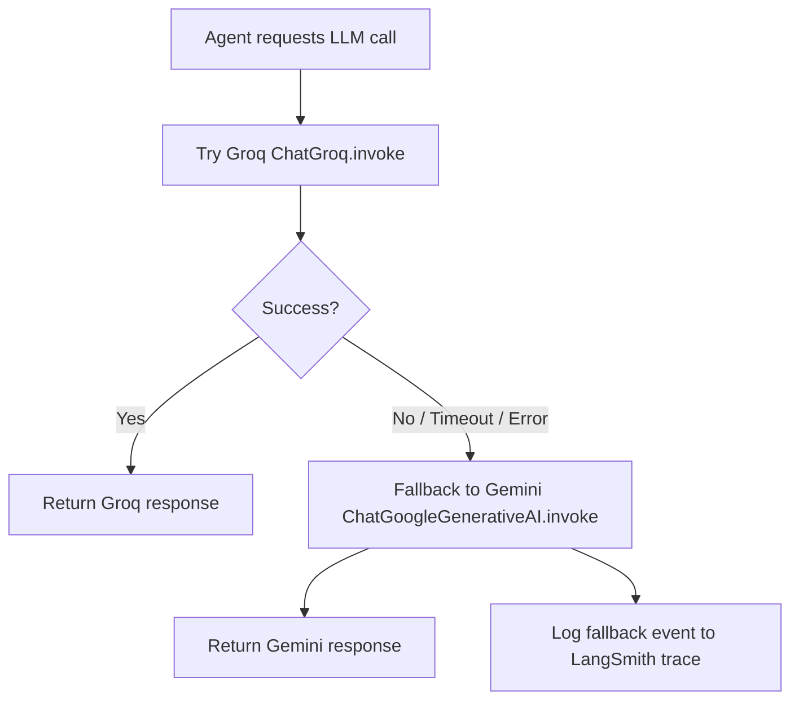
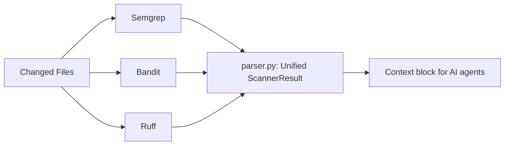
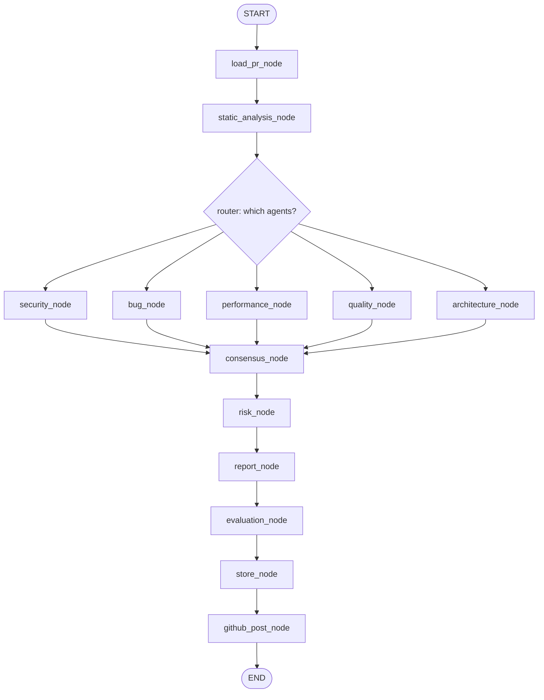
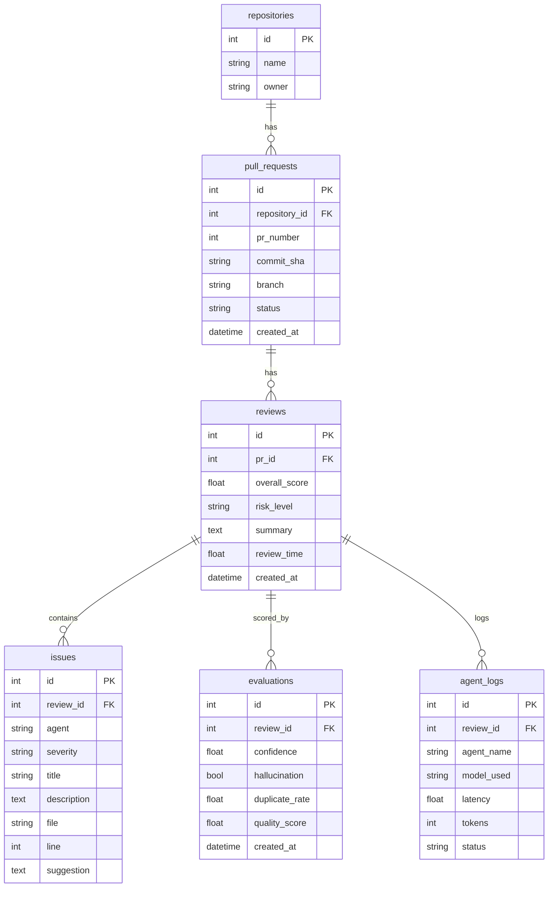
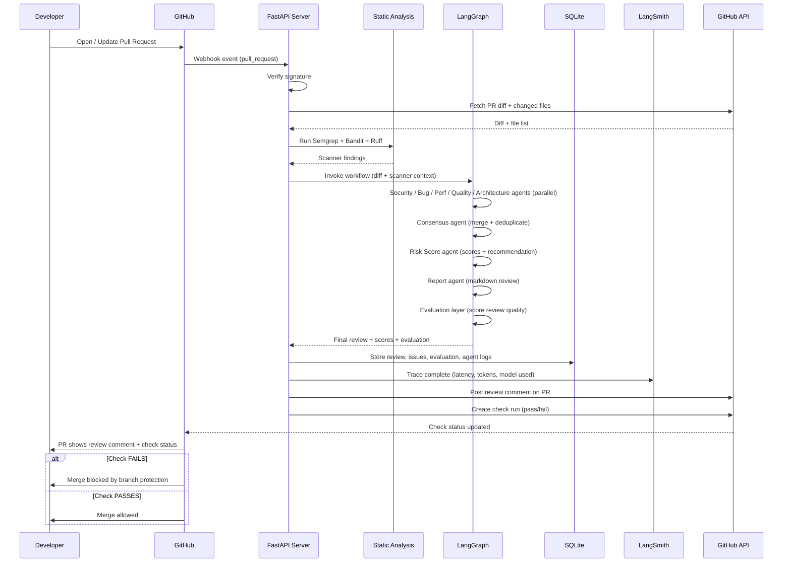

# CodeGuardian AI — Implementation Plan

> **Production-ready Multi-Agent AI Code Review Platform with Automated GitHub PR Gatekeeping**

---

## 1. Project Overview

| Field | Value |
|---|---|
| **Project Name** | CodeGuardian AI |
| **Tagline** | Production-ready Multi-Agent AI Code Review Platform with Automated GitHub PR Gatekeeping |
| **Objective** | Build a fully autonomous AI code review system that listens for GitHub Pull Request events through GitHub Webhooks, analyzes only the changed code using multiple specialized AI agents, combines AI reasoning with static analysis, evaluates review quality, tracks every run with LangSmith, stores results in SQLite, comments on the PR, and blocks unsafe merges through GitHub Branch Protection. |
| **Approach** | Hybrid — keep existing `src/` agents as reference, build the new `codeguardian-ai/` structure alongside, migrate incrementally |

---

## 2. Current State Assessment

The existing codebase (`src/`, `evals/`, `examples/`) is a **CLI-based** multi-agent reviewer using LangGraph + Claude. It will be preserved as a reference implementation. The new CodeGuardian AI platform will be built as a parallel structure and will reuse concepts, prompts, and patterns from the existing agents.

### What We Keep as Reference
- [`src/agents/orchestrator.py`](src/agents/orchestrator.py:1) — routing logic pattern
- [`src/agents/security.py`](src/agents/security.py:1) — security prompt template
- [`src/agents/bug_detector.py`](src/agents/bug_detector.py:1) — bug detection prompt
- [`src/agents/code_quality.py`](src/agents/code_quality.py:1) — quality prompt
- [`src/agents/summarizer.py`](src/agents/summarizer.py:1) — consensus/synthesis pattern
- [`src/chunker.py`](src/chunker.py:1) — diff chunking logic
- [`src/state.py`](src/state.py:1) — TypedDict state pattern with `operator.add` reducers
- [`src/graph.py`](src/graph.py:1) — LangGraph fan-out/fan-in topology

### What Changes
| Aspect | Current | Target |
|---|---|---|
| Interface | CLI (`code-review` command) | FastAPI webhook server |
| Trigger | Manual / GitHub Action | GitHub Webhook (real-time) |
| LLM | Claude (Anthropic) | Groq (primary) + Gemini (fallback) |
| Static Analysis | None | Semgrep + Bandit + Ruff |
| Agents | 6 (orchestrator, bug, security, quality, test, summarizer) | 8 (security, bug, performance, quality, architecture, consensus, risk, report) |
| Storage | Log file only | SQLite via SQLAlchemy |
| Observability | Python logging | LangSmith tracing |
| Evaluation | Keyword matching (4 cases) | Multi-metric evaluation layer |
| Deployment | `pip install` | Docker container |
| Gatekeeping | None | GitHub Check API + Branch Protection |

---

## 3. Target Architecture



---

## 4. Technology Stack

| Layer | Technology | Rationale |
|---|---|---|
| Backend | FastAPI | Async webhook handling, auto-docs, lightweight |
| Agent Framework | LangGraph | Already used in existing codebase; fan-out/fan-in native |
| Primary LLM | Groq (via `langchain-groq` / `ChatGroq`) | Ultra-low latency inference |
| Fallback LLM | Gemini (via `langchain-google-genai` / `ChatGoogleGenerativeAI`) | High availability fallback |
| Evaluation | LangSmith Evaluations | Built-in eval framework, trace-based |
| Observability | LangSmith Tracing | Per-agent latency, token usage, prompt versioning |
| Database | SQLite | Zero-config, file-based, sufficient for single-instance |
| ORM | SQLAlchemy | Mature, async support, migrations-ready |
| Static Analysis | Semgrep | Pattern-based, multi-language |
| Security Scanner | Bandit | Python-specific AST security scanner |
| Linter | Ruff | Fast Python linter + formatter |
| GitHub Integration | GitHub Webhooks + PyGithub (REST API) | Webhook signature verification, PR comments, check runs |
| Deployment | Docker + docker-compose | Reproducible, portable |
| Language | Python 3.11+ | Matches existing codebase |

---

## 5. Folder Structure

```
codeguardian-ai/
├── agents/
│   ├── __init__.py
│   ├── security_agent.py        # SQLi, XSS, command injection, secrets, JWT
│   ├── bug_agent.py             # Logic errors, validation, null refs, race conditions
│   ├── performance_agent.py     # Nested loops, duplicate computation, slow queries
│   ├── quality_agent.py         # SOLID, DRY, naming, readability
│   ├── architecture_agent.py    # Layer separation, dependency direction, circular deps
│   ├── consensus_agent.py       # Merge findings, deduplicate, resolve conflicts
│   ├── risk_agent.py            # Security/perf/maintainability scores, merge recommendation
│   └── report_agent.py         # Markdown review, PR summary, GitHub comment body
│
├── graph/
│   ├── __init__.py
│   ├── workflow.py              # LangGraph StateGraph definition (build + compile)
│   ├── state.py                 # CodeGuardianState TypedDict with reducers
│   ├── router.py                # Orchestrator routing logic (which agents to run)
│   └── nodes.py                # Node wrapper functions binding agents to graph
│
├── scanners/
│   ├── __init__.py
│   ├── semgrep.py               # Run semgrep, parse JSON output
│   ├── bandit.py                # Run bandit, parse JSON output
│   ├── ruff.py                  # Run ruff check, parse JSON output
│   └── parser.py                # Unified scanner result dataclass + merge logic
│
├── github/
│   ├── __init__.py
│   ├── webhook.py               # Signature verification (HMAC SHA-256)
│   ├── github_api.py            # PyGithub wrapper: fetch PR, files, diff
│   ├── comments.py              # Post/ update review comment on PR
│   ├── checks.py                # Create check run with pass/fail status
│   └── diff.py                  # Parse unified diff, extract changed files + line ranges
│
├── llm/
│   ├── __init__.py
│   ├── groq_client.py           # ChatGroq instance factory
│   ├── gemini_client.py         # ChatGoogleGenerativeAI instance factory
│   └── router.py                # Try Groq → fallback Gemini routing logic
│
├── database/
│   ├── __init__.py
│   ├── database.py              # Engine + session factory (SQLite)
│   ├── models.py                # SQLAlchemy ORM models (6 tables)
│   └── crud.py                 # CRUD operations for all models
│
├── prompts/
│   ├── __init__.py
│   ├── security.txt
│   ├── bug.txt
│   ├── performance.txt
│   ├── quality.txt
│   ├── architecture.txt
│   ├── consensus.txt
│   ├── risk.txt
│   └── report.txt
│
├── evaluation/
│   ├── __init__.py
│   ├── evaluator.py             # Run evaluation metrics on a completed review
│   ├── metrics.py               # Hallucination, relevance, duplication, severity, completeness
│   └── datasets.py              # Curated eval cases (migrated from evals/cases.py)
│
├── observability/
│   ├── __init__.py
│   └── langsmith.py             # Trace context manager, trace config, metric extraction
│
├── reports/
│   └── .gitkeep                 # Generated review markdown files (runtime)
│
├── api/
│   ├── __init__.py
│   └── routes.py                # FastAPI router: /github/webhook, /health, /reviews/{id}
│
├── tests/
│   ├── __init__.py
│   ├── test_webhook.py
│   ├── test_scanners.py
│   ├── test_agents.py
│   ├── test_graph.py
│   ├── test_llm_router.py
│   ├── test_database.py
│   └── test_evaluation.py
│
├── config.py                    # Central config: env vars, model names, thresholds
├── review.db                    # SQLite database (gitignored)
├── Dockerfile
├── docker-compose.yml
├── requirements.txt
├── .env.example
└── main.py                      # FastAPI app entry point (uvicorn)
```

---

## 6. Multi-Agent System Detail

### 6.1 Agent Roster

| # | Agent | File | Responsibility | Input | Output |
|---|---|---|---|---|---|
| 1 | Security | `agents/security_agent.py` | SQLi, XSS, command injection, path traversal, API key leakage, JWT issues, hardcoded secrets | Diff + scanner findings | List of security findings with severity |
| 2 | Bug | `agents/bug_agent.py` | Logic errors, missing validation, null references, exception handling, race conditions | Diff + scanner findings | List of bug findings with severity |
| 3 | Performance | `agents/performance_agent.py` | Nested loops, duplicate computation, slow DB queries, memory inefficiencies, algorithm complexity | Diff + scanner findings | List of perf findings with severity |
| 4 | Quality | `agents/quality_agent.py` | SOLID, DRY, naming, readability, maintainability | Diff + scanner findings | List of quality findings with severity |
| 5 | Architecture | `agents/architecture_agent.py` | Layer separation, dependency direction, folder organization, circular dependencies | Diff + file tree | List of architecture findings |
| 6 | Consensus | `agents/consensus_agent.py` | Merge all findings, remove duplicates, resolve conflicting conclusions, prioritize by severity | All agent outputs | Deduplicated, prioritized finding list |
| 7 | Risk Score | `agents/risk_agent.py` | Security score, maintainability score, performance score, overall score, merge recommendation | Consensus output | Score object + recommendation |
| 8 | Report | `agents/report_agent.py` | Markdown review, PR summary, improvement suggestions, final GitHub comment | Consensus + risk output | Formatted markdown string |

### 6.2 Agent Execution Flow



### 6.3 Agent Interface Contract

Every agent follows a uniform interface (adapted from existing `src/agents/` pattern):

```python
class AgentFinding(TypedDict):
    agent: str               # e.g. "security"
    severity: str            # CRITICAL / HIGH / MEDIUM / LOW
    title: str
    description: str
    file: str
    line: int | None
    suggestion: str

def <agent>_node(state: CodeGuardianState) -> dict:
    """Returns {findings_key: [AgentFinding, ...]}"""
```

---

## 7. LLM Routing Strategy



### Implementation (`llm/router.py`)
- `LLMRouter` class with `invoke(messages) -> str`
- Configurable timeout (default 30s for Groq)
- Automatic fallback on: `TimeoutError`, `RateLimitError`, `APIConnectionError`, generic `Exception`
- Logs which model was used for each call (stored in `agent_logs` table)
- Both clients use `temperature=0` for deterministic output

### Environment Variables
```
GROQ_API_KEY=...
GEMINI_API_KEY=...
GROQ_MODEL=llama-3.3-70b-versatile
GEMINI_MODEL=gemini-2.0-flash
LLM_TIMEOUT_SECONDS=30
```

---

## 8. Static Analysis Layer

Runs **before** any AI reasoning. Results are injected into agent prompts as context.



### Scanner Output Schema (`scanners/parser.py`)
```python
@dataclass
class ScannerFinding:
    scanner: str          # "semgrep" | "bandit" | "ruff"
    rule_id: str
    severity: str        # CRITICAL / HIGH / MEDIUM / LOW / INFO
    file: str
    line: int
    message: str

@dataclass
class ScannerResult:
    findings: list[ScannerFinding]
    raw_outputs: dict[str, str]   # per-scanner raw JSON
    total_findings: int
```

### Scanner Execution
- Each scanner runs as a **subprocess** against the downloaded changed files
- Output parsed from `--json` flag
- `parser.py` merges all findings into a single `ScannerResult`
- Merged result is formatted as a context block and passed to each agent's prompt

---

## 9. LangGraph Workflow

### 9.1 State Definition (`graph/state.py`)
```python
class CodeGuardianState(TypedDict):
    # Input
    pr_number: int
    commit_sha: str
    repository: str
    branch: str
    code_diff: str
    changed_files: list[str]
    file_contents: dict[str, str]

    # Static analysis
    scanner_result: ScannerResult

    # Agent findings (accumulated via operator.add)
    security_findings: Annotated[list[dict], operator.add]
    bug_findings: Annotated[list[dict], operator.add]
    performance_findings: Annotated[list[dict], operator.add]
    quality_findings: Annotated[list[dict], operator.add]
    architecture_findings: Annotated[list[dict], operator.add]

    # Consensus + risk
    consensus_findings: list[dict]
    risk_scores: dict
    merge_recommendation: str

    # Output
    final_report: str
    evaluation: dict
```

### 9.2 Graph Topology (`graph/workflow.py`)


### 9.3 Router Logic (`graph/router.py`)
- Always run: security, bug, quality
- Run performance if: loops, DB queries, or large data structures detected in diff
- Run architecture if: new files/directories added, or imports changed across modules
- Uses file paths + diff content (similar to existing [`orchestrator_node()`](src/agents/orchestrator.py:40))

---

## 10. Evaluation Layer

### 10.1 Metrics (`evaluation/metrics.py`)

| Metric | Method | Target |
|---|---|---|
| Hallucination rate | Check if findings reference code not in diff | < 5% |
| Issue relevance | Keyword + semantic match against scanner findings | > 80% |
| Duplicate issue rate | Compare finding titles/descriptions across agents | < 10% |
| Severity consistency | Compare agent severity vs consensus severity | > 90% |
| Completeness | Coverage of known issue categories | > 85% |
| Markdown formatting | Structural check (headers, code blocks, lists) | 100% |
| Overall confidence | Weighted composite | > 0.85 |

### 10.2 Evaluation Output
```json
{
  "confidence": 0.94,
  "hallucination": false,
  "duplicate_findings": 0,
  "severity_consistency": 0.97,
  "overall_quality": 0.95
}
```

### 10.3 Evaluation Strategy
- **Phase 1 (initial):** Rule-based evaluators — regex checks, structural validation, keyword matching
- **Phase 2 (later):** LLM-as-a-judge via LangSmith — use a strong model to grade review quality against rubric
- Every evaluation is stored in the `evaluations` table and traced in LangSmith

---

## 11. LangSmith Integration

### 11.1 Tracing (`observability/langsmith.py`)
- Set `LANGCHAIN_TRACING_V2=true`, `LANGCHAIN_API_KEY`, `LANGCHAIN_PROJECT` via env
- LangGraph automatically traces each node execution
- Custom trace metadata added per review: `pr_number`, `commit_sha`, `repository`

### 11.2 What Each Trace Records
| Field | Source |
|---|---|
| Webhook request | FastAPI middleware |
| Static analysis duration | Scanner subprocess timing |
| Agent execution order | LangGraph node traces |
| Prompt versions | Prompt file hashes |
| Model used | LLM router logging |
| Token usage | LangChain callback |
| Latency | Per-node timing |
| Errors | Exception capture |
| Final outputs | Report + evaluation |

---

## 12. SQLite Database Schema

### 12.1 Entity Relationship



### 12.2 Models (`database/models.py`)
- 6 SQLAlchemy ORM models matching the ERD above
- `Base = declarative_base()` shared across models
- `created_at` columns default to `func.now()`
- Foreign keys with `ondelete="CASCADE"`

### 12.3 CRUD (`database/crud.py`)
- `create_repository()`, `get_or_create_repository()`
- `create_pull_request()`, `get_pull_request()`
- `create_review()`, `get_review()`, `get_reviews_by_pr()`
- `create_issue()`, `bulk_create_issues()`
- `create_evaluation()`
- `create_agent_log()`, `bulk_create_agent_logs()`

---

## 13. GitHub Integration

### 13.1 Webhook Handling (`github/webhook.py`)
- Endpoint: `POST /github/webhook`
- Verify `X-Hub-Signature-256` header using HMAC-SHA256 with `GITHUB_WEBHOOK_SECRET`
- Parse `pull_request` event (`opened` or `synchronize` actions)
- Extract: `pr_number`, `commit_sha`, `repository.full_name`, `head.ref` (branch)

### 13.2 GitHub API (`github/github_api.py`)
- Uses `PyGithub` library
- `fetch_pr_diff(repo, pr_number) -> str` — unified diff
- `fetch_changed_files(repo, pr_number) -> list[str]` — file paths
- `fetch_file_content(repo, path, ref) -> str` — individual file content
- `post_pr_comment(repo, pr_number, body) -> None`
- `create_check_run(repo, head_sha, status, conclusion, output) -> None`

### 13.3 Check Status (`github/checks.py`)
- Creates a GitHub Check Run named "CodeGuardian AI Review"
- Status: `in_progress` → `completed`
- Conclusion: `success` (PASS) or `failure` (FAIL)
- Output includes summary + report link
- Branch Protection rule requires this check to pass before merge

### 13.4 Branch Protection Configuration
- Repository Settings → Branches → Branch Protection Rules
- Require status checks: "CodeGuardian AI Review" must pass
- This is a manual setup step documented in README

---

## 14. FastAPI Application

### 14.1 Endpoints (`api/routes.py`)
| Method | Path | Purpose |
|---|---|---|
| `GET` | `/health` | Health check (returns `{"status": "ok"}`) |
| `POST` | `/github/webhook` | Receive + process GitHub PR webhook |
| `GET` | `/reviews/{review_id}` | Retrieve a stored review by ID |
| `GET` | `/reviews` | List recent reviews (paginated) |

### 14.2 Entry Point (`main.py`)
```python
# Pseudocode structure
from fastapi import FastAPI
from api.routes import router

app = FastAPI(title="CodeGuardian AI", version="1.0.0")
app.include_router(router)

if __name__ == "__main__":
    import uvicorn
    uvicorn.run(app, host="0.0.0.0", port=8000)
```

### 14.3 Webhook Processing Flow
1. Receive POST → verify signature
2. Extract PR metadata
3. Fetch diff + changed files via GitHub API
4. Download file contents
5. Run static analysis (Semgrep, Bandit, Ruff)
6. Invoke LangGraph workflow
7. Store results in SQLite
8. Post review comment on PR
9. Update GitHub Check Run status
10. Return 200 OK

---

## 15. Configuration (`config.py`)

```python
# Central configuration — all env-driven

# LLM
GROQ_API_KEY: str           # from env
GEMINI_API_KEY: str         # from env
GROQ_MODEL: str             # default: "llama-3.3-70b-versatile"
GEMINI_MODEL: str           # default: "gemini-2.0-flash"
LLM_TIMEOUT_SECONDS: int   # default: 30

# GitHub
GITHUB_WEBHOOK_SECRET: str  # from env
GITHUB_TOKEN: str            # from env (PAT or app token)

# LangSmith
LANGCHAIN_TRACING_V2: bool  # True
LANGCHAIN_API_KEY: str       # from env
LANGCHAIN_PROJECT: str       # default: "codeguardian-ai"

# Database
DATABASE_URL: str            # default: "sqlite:///./review.db"

# Risk thresholds
RISK_FAIL_THRESHOLD: float   # default: 0.4 — below this, merge blocked
MAX_DIFF_CHARS: int          # default: 40_000 (reused from existing config)
```

---

## 16. Deployment

### 16.1 Dockerfile
```dockerfile
FROM python:3.11-slim

# Install static analysis tools
RUN apt-get update && apt-get install -y git semgrep
RUN pip install bandit ruff

WORKDIR /app
COPY requirements.txt .
RUN pip install --no-cache-dir -r requirements.txt

COPY . .
RUN pip install -e .

EXPOSE 8000
CMD ["uvicorn", "main:app", "--host", "0.0.0.0", "--port", "8000"]
```

### 16.2 docker-compose.yml
```yaml
version: "3.8"
services:
  codeguardian:
    build: .
    ports:
      - "8000:8000"
    env_file:
      - .env
    volumes:
      - ./review.db:/app/review.db
      - ./reports:/app/reports
    restart: unless-stopped
```

### 16.3 `.env`
```
# LLM
GROQ_API_KEY=your_groq_key
GEMINI_API_KEY=your_gemini_key

# GitHub
GITHUB_WEBHOOK_SECRET=your_webhook_secret
GITHUB_TOKEN=your_github_pat

# LangSmith
LANGCHAIN_API_KEY=your_langsmith_key
LANGCHAIN_PROJECT=codeguardian-ai

# Database
DATABASE_URL=sqlite:///./review.db
```

---

## 17. End-to-End Flow



---

## 18. Implementation Todo List

The work is broken into phases. Each phase is independently testable.

### Phase 1 — Foundation & Scaffolding
- [ ] 1.1 Create `codeguardian-ai/` directory structure (all folders + `__init__.py`)
- [ ] 1.2 Write `config.py` with all env-driven settings
- [ ] 1.3 Write `.env` with all required variables
- [ ] 1.4 Write `requirements.txt` with all dependencies
- [ ] 1.5 Write `Dockerfile` and `docker-compose.yml`

### Phase 2 — LLM Routing Layer
- [ ] 2.1 Implement `llm/groq_client.py` — ChatGroq factory
- [ ] 2.2 Implement `llm/gemini_client.py` — ChatGoogleGenerativeAI factory
- [ ] 2.3 Implement `llm/router.py` — try Groq, fallback Gemini, log model used
- [ ] 2.4 Write `tests/test_llm_router.py` — mock both clients, test fallback

### Phase 3 — Database Layer
- [ ] 3.1 Implement `database/models.py` — 6 SQLAlchemy models (repositories, pull_requests, reviews, issues, evaluations, agent_logs)
- [ ] 3.2 Implement `database/database.py` — engine + session factory + table creation
- [ ] 3.3 Implement `database/crud.py` — all CRUD operations
- [ ] 3.4 Write `tests/test_database.py` — in-memory SQLite, test all CRUD ops

### Phase 4 — Static Analysis Scanners
- [ ] 4.1 Implement `scanners/parser.py` — ScannerFinding + ScannerResult dataclasses, merge logic
- [ ] 4.2 Implement `scanners/semgrep.py` — subprocess runner + JSON parser
- [ ] 4.3 Implement `scanners/bandit.py` — subprocess runner + JSON parser
- [ ] 4.4 Implement `scanners/ruff.py` — subprocess runner + JSON parser
- [ ] 4.5 Write `tests/test_scanners.py` — sample files, verify parsed findings

### Phase 5 — GitHub Integration
- [ ] 5.1 Implement `github/webhook.py` — HMAC-SHA256 signature verification
- [ ] 5.2 Implement `github/diff.py` — parse unified diff, extract changed files + line ranges
- [ ] 5.3 Implement `github/github_api.py` — PyGithub wrapper (fetch PR, files, diff, file content)
- [ ] 5.4 Implement `github/comments.py` — post/update PR review comment
- [ ] 5.5 Implement `github/checks.py` — create check run with pass/fail status
- [ ] 5.6 Write `tests/test_webhook.py` — mock webhook payloads, test signature verification

### Phase 6 — Agent Prompts
- [ ] 6.1 Write `prompts/security.txt` (adapt from existing [`src/agents/security.py`](src/agents/security.py:13) prompt)
- [ ] 6.2 Write `prompts/bug.txt` (adapt from existing [`src/agents/bug_detector.py`](src/agents/bug_detector.py:13) prompt)
- [ ] 6.3 Write `prompts/performance.txt` (new)
- [ ] 6.4 Write `prompts/quality.txt` (adapt from existing [`src/agents/code_quality.py`](src/agents/code_quality.py:13) prompt)
- [ ] 6.5 Write `prompts/architecture.txt` (new)
- [ ] 6.6 Write `prompts/consensus.txt` (adapt from existing [`src/agents/summarizer.py`](src/agents/summarizer.py:13) prompt)
- [ ] 6.7 Write `prompts/risk.txt` (new)
- [ ] 6.8 Write `prompts/report.txt` (new)

### Phase 7 — Agent Implementations
- [ ] 7.1 Implement `agents/security_agent.py` — uses LLM router + scanner context
- [ ] 7.2 Implement `agents/bug_agent.py` — uses LLM router + scanner context
- [ ] 7.3 Implement `agents/performance_agent.py` — uses LLM router + scanner context
- [ ] 7.4 Implement `agents/quality_agent.py` — uses LLM router + scanner context
- [ ] 7.5 Implement `agents/architecture_agent.py` — uses LLM router + file tree
- [ ] 7.6 Implement `agents/consensus_agent.py` — merge, deduplicate, resolve conflicts, prioritize
- [ ] 7.7 Implement `agents/risk_agent.py` — compute scores + merge recommendation
- [ ] 7.8 Implement `agents/report_agent.py` — generate markdown review + GitHub comment body
- [ ] 7.9 Write `tests/test_agents.py` — mock LLM, test each agent returns valid findings

### Phase 8 — LangGraph Workflow
- [ ] 8.1 Implement `graph/state.py` — CodeGuardianState TypedDict with reducers
- [ ] 8.2 Implement `graph/router.py` — routing logic (which agents to activate)
- [ ] 8.3 Implement `graph/nodes.py` — node wrapper functions binding agents to graph
- [ ] 8.4 Implement `graph/workflow.py` — build + compile StateGraph (fan-out → fan-in → consensus → risk → report → eval)
- [ ] 8.5 Write `tests/test_graph.py` — mock all agents, test graph executes end-to-end

### Phase 9 — Evaluation Layer
- [ ] 9.1 Implement `evaluation/metrics.py` — all 7 metrics (hallucination, relevance, duplication, severity, completeness, formatting, confidence)
- [ ] 9.2 Implement `evaluation/evaluator.py` — run metrics on a completed review, return evaluation dict
- [ ] 9.3 Implement `evaluation/datasets.py` — migrate eval cases from existing [`evals/cases.py`](evals/cases.py:13), add new cases
- [ ] 9.4 Write `tests/test_evaluation.py` — test each metric with known inputs

### Phase 10 — Observability
- [ ] 10.1 Implement `observability/langsmith.py` — trace config, custom metadata, metric extraction
- [ ] 10.2 Verify LangSmith traces appear for each graph node execution

### Phase 11 — FastAPI Application
- [ ] 11.1 Implement `api/routes.py` — /health, /github/webhook, /reviews/{id}, /reviews
- [ ] 11.2 Implement `main.py` — FastAPI app, router inclusion, uvicorn entry point
- [ ] 11.3 Wire webhook endpoint to full pipeline (fetch → scan → graph → store → comment → check)
- [ ] 11.4 Write `tests/test_webhook.py` — end-to-end mock test

### Phase 12 — Docker & Deployment
- [ ] 12.1 Finalize `Dockerfile` (Python 3.11-slim, semgrep, bandit, ruff, deps)
- [ ] 12.2 Finalize `docker-compose.yml` (port mapping, env file, volume for DB + reports)
- [ ] 12.3 Test `docker-compose up` builds and starts server
- [ ] 12.4 Document GitHub webhook setup + branch protection configuration in README

### Phase 13 — Documentation & Migration
- [ ] 13.1 Write `codeguardian-ai/README.md` — setup, env vars, webhook config, branch protection, Docker deploy
- [ ] 13.2 Document API endpoints (FastAPI auto-docs at /docs)
- [ ] 13.3 Add migration notes: how existing `src/` agents map to new `agents/` modules
- [ ] 13.4 Final review of all tests passing

---

## 19. Dependency List (`requirements.txt`)

```
# Web framework
fastapi>=0.115.0
uvicorn[standard]>=0.30.0
pydantic>=2.0.0

# Agent framework
langgraph>=0.2.0
langchain-core>=0.3.0
langchain-groq>=0.1.0
langchain-google-genai>=1.0.0

# LLM SDKs (for direct fallback control)
groq>=0.11.0
google-generativeai>=0.7.0

# GitHub
PyGithub>=2.0.0

# Database
sqlalchemy>=2.0.0

# Static analysis (installed via pip)
semgrep>=1.50.0
bandit>=1.7.0
ruff>=0.5.0

# Observability
langsmith>=0.1.0

# Utilities
python-dotenv>=1.0.0
httpx>=0.27.0
```

---

## 20. Risk Thresholds & Scoring Logic

### Risk Score Computation (`agents/risk_agent.py`)
```
security_score     = weighted avg of security finding severities (CRITICAL=0, HIGH=0.25, MEDIUM=0.5, LOW=0.75, NONE=1.0)
performance_score  = weighted avg of performance finding severities
maintainability_score = weighted avg of quality + architecture finding severities
overall_score      = 0.5 * security_score + 0.3 * maintainability_score + 0.2 * performance_score

if overall_score >= 0.85:  recommendation = "APPROVE"
if 0.6 <= overall_score < 0.85: recommendation = "APPROVE WITH SUGGESTIONS"
if 0.4 <= overall_score < 0.6: recommendation = "REQUEST CHANGES"
if overall_score < 0.4: recommendation = "BLOCK MERGE"
```

### GitHub Check Mapping
| Recommendation | Check Conclusion | Merge |
|---|---|---|
| APPROVE | `success` | Allowed |
| APPROVE WITH SUGGESTIONS | `success` | Allowed |
| REQUEST CHANGES | `failure` | Blocked |
| BLOCK MERGE | `failure` | Blocked |

---

## 21. Migration Notes (Existing → New)

| Existing File | New Location | Action |
|---|---|---|
| [`src/agents/security.py`](src/agents/security.py:1) | `agents/security_agent.py` + `prompts/security.txt` | Adapt prompt, add scanner context, switch to LLM router |
| [`src/agents/bug_detector.py`](src/agents/bug_detector.py:1) | `agents/bug_agent.py` + `prompts/bug.txt` | Adapt prompt, add scanner context |
| [`src/agents/code_quality.py`](src/agents/code_quality.py:1) | `agents/quality_agent.py` + `prompts/quality.txt` | Adapt prompt, add scanner context |
| [`src/agents/summarizer.py`](src/agents/summarizer.py:1) | `agents/consensus_agent.py` + `prompts/consensus.txt` | Expand: dedup + conflict resolution + prioritization |
| [`src/agents/orchestrator.py`](src/agents/orchestrator.py:1) | `graph/router.py` | Adapt routing logic for new agent set |
| [`src/state.py`](src/state.py:1) | `graph/state.py` | Expand TypedDict with new fields |
| [`src/graph.py`](src/graph.py:1) | `graph/workflow.py` | Expand topology: add consensus, risk, report, eval nodes |
| [`src/chunker.py`](src/chunker.py:1) | `graph/nodes.py` (inline) | Reuse diff chunking logic in load_pr_node |
| [`src/config.py`](src/config.py:1) | `config.py` | Expand with all new env-driven settings |
| [`evals/cases.py`](evals/cases.py:1) | `evaluation/datasets.py` | Migrate 4 cases, add new cases for perf/architecture |
| [`src/cli.py`](src/cli.py:1) | (deprecated) | Replaced by FastAPI webhook endpoint |
| [`code_review/__init__.py`](code_review/__init__.py:1) | (deprecated) | Replaced by `codeguardian-ai/main.py` |

---

This plan is the complete blueprint for CodeGuardian AI. Each phase is independently buildable and testable. The existing `src/` codebase remains untouched as a reference implementation throughout the build.
